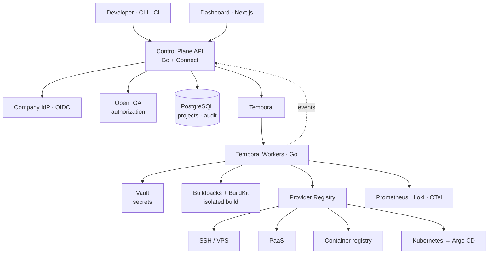

# Veyronix — Internal Developer Platform


**One deployment workflow for every infrastructure provider.**

*Provider-agnostic application delivery. Durable, resumable deployments on Temporal. Relationship-based authorization via OpenFGA. Secrets in Vault. Adding a target is a plugin, not a rewrite.*

[Architecture](#architecture) • [RPD](docs/RPD.md) • [Engineering Design](docs/ENGINEERING.md) • [ADRs](docs/adr) • [SLOs](#service-level-objectives) • [Runbook](docs/RUNBOOK.md)

---

## Project Status

> **Veyronix is in active design and early implementation. It does not yet deploy anything end to end.** This README documents the system as designed and marks precisely what exists today. Nothing is claimed as shipped unless the status table says so.

| Component | State |
|---|---|
| RPD, engineering design, ADRs | Written |
| Provider interface + SDK contract | Defined |
| Control plane API (Go + Connect) | Skeleton |
| Temporal workflow + activities | Not started |
| OpenFGA authorization model | Drafted |
| Vault integration | Not started |
| SSH / VPS provider | Not started |
| Dashboard (Next.js) | Not started |
| Observability stack | Not started |

---

## What is Veyronix?

Deployment knowledge does not scale. In most engineering organizations the frontend goes to a CDN, one backend lives on a VPS reached by SSH, an older service still runs on a PaaS, and the newest thing landed wherever the person who built it knew how to deploy. Every one of those has a different workflow, a different credential path, and a different person who understands it. The cost is not the deployment — it is that deployment becomes tribal knowledge, and tribal knowledge is an outage waiting for a vacation.

Veyronix collapses all of it behind one question: *which project, which environment, which version.* Everything after that is the platform's problem.

### What this project actually builds

**One thing: a provider abstraction over heterogeneous deployment targets.** The deployment engine never knows what a provider *is*. It knows only that something implements `Deploy`, `Rollback`, `Status`, `Logs`, and `HealthCheck`. SSH is a few hundred lines behind that interface. So is a PaaS. So is Kubernetes. Adding a target means writing a provider and registering it — engine untouched, dashboard untouched, permission model untouched.

**Everything else is bought, not built.** Durable execution is Temporal. Authorization is OpenFGA. Secrets are Vault. Identity is the company IdP over OIDC. Builds are Cloud Native Buildpacks in rootless BuildKit. Kubernetes deploys go through Argo CD rather than pushing at a cluster from outside.

That division is the design. An earlier iteration of this system hand-rolled a lease-based job queue with a transactional outbox, a hybrid RBAC/ABAC engine, and an envelope-encryption scheme. Each is a worthwhile thing to write once in order to understand it. None is a defensible thing to *operate* in production with a bus factor of one. The test applied to every component: **if this breaks at 2am and I am unavailable, can someone else fix it?** Temporal's failure modes are documented and shared by thousands of users. A bespoke lease reclaim race is not.

### Why not just use an existing tool?

| Tool | Why it does not solve this | Where we use it anyway |
|---|---|---|
| **Argo CD** | Kubernetes-only. Cannot deploy to SSH hosts, PaaS, or CDN targets. | Inside the Kubernetes provider — Veyronix writes manifests to git, Argo reconciles. |
| **Terraform / Pulumi** | Provisions infrastructure. Does not model a release, rollback, or health verification. | Provisions the infrastructure Veyronix deploys onto. |
| **GitHub Actions** | Builds artifacts well. No durable state, no rollback, no per-environment concurrency, no authorization over targets. | Builds artifacts and triggers Veyronix. |
| **Backstage** | A portal and service catalog with no deployment engine. Backstage plugins call something like Veyronix. | Candidate front end later. |
| **Heroku / Vercel / Render** | Single-target platforms. Adopting one means migrating everything to it. | They are targets, not the platform. |

**The real question this system answers:** what is the state of a deployment when the machine running it disappears halfway through? Veyronix has a specific answer — the workflow history is in Temporal, completed activities are not re-executed, and a replacement worker resumes from the last durable step. Most internal deploy scripts have no answer at all.

---

## Architecture



Three processes we run: the control plane API, Temporal workers, and the dashboard. Temporal, Postgres, Vault, and OpenFGA are dependencies.

---

## The Deployment Workflow

A deployment is a Temporal workflow; each step is an activity with its own retry policy and timeout.

```
DeploymentWorkflow(project, env, version)
  ├─ ResolveTarget       provider + config for this environment
  ├─ AwaitApproval       [production only] durable signal wait
  ├─ Checkout            clone at commit into an isolated workspace
  ├─ Build               Buildpacks in rootless BuildKit → artifact
  ├─ Deploy              provider.Deploy() with idempotency key
  ├─ HealthCheck         retried with backoff
  │
  ├─ healthy   → RecordSuccess · Notify
  └─ unhealthy → Rollback → RecordRollback · Notify
                 └─ rollback failed → FreezeEnvironment · PageOnCall
```

Four properties fall out of the execution model rather than out of code we maintain:

- **The workflow survives the worker.** Temporal replays history onto a new worker; completed activities do not re-run.
- **Exactly-once effect.** Workflow ID is `{project}-{env}-{commit}` — Temporal rejects duplicate starts. The idempotency key is passed to the provider as defence in depth.
- **One deploy per environment at a time.** A long-lived `EnvironmentWorkflow` per (project, environment) receives requests as signals and runs them as child workflows serially. No distributed lock.
- **Approval is just waiting.** `GetSignalChannel` with a timeout — the workflow waits durably for hours or days without holding a connection or a row lock.

---

## The Provider Contract

```go
// Provider is the only thing the deployment engine knows about a target.
type Provider interface {
    Name() string
    Validate(ctx context.Context, target Target) error

    // Deploy must be idempotent with respect to req.IdempotencyKey.
    // It may be called more than once for the same logical deployment.
    Deploy(ctx context.Context, req DeployRequest) (Release, error)

    Rollback(ctx context.Context, to Release) error
    Status(ctx context.Context, rel Release) (ReleaseStatus, error)
    Logs(ctx context.Context, rel Release, opts LogOptions) (<-chan LogLine, error)
    HealthCheck(ctx context.Context, rel Release) error

    // Capabilities declares what this target actually supports, so the
    // engine and UI degrade visibly instead of failing at runtime.
    Capabilities() Capabilities
}
```

`Capabilities()` exists because honesty beats a leaky abstraction. A CDN cannot do a canary. A bare VPS cannot do blue/green unaided. Providers declare what they support rather than pretending every target is equivalent.

`sdk/` ships this interface plus a conformance suite. **A provider that passes the suite integrates with zero engine changes** — that is the assertion the architecture rests on, so it is tested rather than assumed.

---

## Authorization

OpenFGA, Zanzibar-model. Outline:

```
type team
  relations
    define member: [user]
type project
  relations
    define owner: [team]
    define deployer: member from owner
type environment
  relations
    define project: [project]
    define deployer: deployer from project
    define approver: [user, team#member]
```

A deploy request checks `Check(user, "deployer", environment:payments-api/production)`. Production additionally requires a distinct approver who is not the requester — that condition is application logic, since "not the same person" is not expressible relationally.

Team membership syncs from IdP group claims at login, so offboarding revokes platform access without a separate step. **Deny by default:** no tuple, no access. **Fail closed:** if OpenFGA is unreachable, the answer is denial.

---

## Secrets

Projects store secret *references* (`vault://kv/payments-api/production#DATABASE_URL`), never values. Resolution happens inside the activity that uses the secret, not as a separate step — because Temporal persists activity inputs and outputs by default, and a secret crossing that boundary is a secret in the workflow history.

Every emitted log line is scrubbed against resolved values before it reaches the event stream, Loki, or the UI. Provider credentials are Vault dynamic secrets where the target supports them, static with documented least-privilege scope where it does not.

---

## Build Isolation

User repository code is untrusted:

- Rootless BuildKit — the Docker socket is never mounted
- No network egress by default; projects declare and allowlist what they need
- No access to the worker's Vault token, cloud credentials, or Temporal client
- Wall-clock and memory limits

Cloud Native Buildpacks handle language detection and dependency installation, which removes the usual reason teams ask for arbitrary build scripts.

---

## Service Level Objectives

| SLI | Definition | SLO | Error budget |
|---|---|---|---|
| **API availability** | Non-5xx control plane responses ÷ total | 99.9% / 30d | ~43m |
| **Deployment success rate** | Succeeded ÷ (Succeeded + platform-caused Failed) | 99.0% / 30d | 1 in 100 |
| **Queue time** | Accepted → workflow started, p95 | < 10s | 5% may exceed |
| **Time to deploy** | Accepted → health check passed, p95 | < 5m | 5% may exceed |
| **Rollback success rate** | Successful ÷ attempted | 99.5% / 30d | 1 in 200 |
| **Time to recovery** | Failed deploy → previous version healthy, p95 | < 3m | 5% may exceed |
| **Event delivery lag** | Activity event → visible in UI, p99 | < 2s | 1% may exceed |

**Error budget policy:** past 50% consumption, new provider work stops and reliability work takes priority. Fully consumed, changes to the platform itself require review. The budget is the forcing function that makes reliability a constraint rather than an aspiration.

---

## Metrics

Every metric answers a question someone will ask during an incident.

| Metric | Type | Labels | Question it answers |
|---|---|---|---|
| `veyronix_deployment_duration_seconds` | histogram | provider, env, phase, outcome | Which phase owns the time? |
| `veyronix_deployment_total` | counter | provider, env, outcome | What is our success rate? |
| `veyronix_rollback_total` | counter | provider, env, trigger | Are we shipping broken releases? |
| `veyronix_workflow_queue_wait_seconds` | histogram | env | Are we worker-starved? |
| `veyronix_activity_retries_total` | counter | activity, provider | What is flaky? |
| `veyronix_build_duration_seconds` | histogram | project, buildpack | Where is deploy time going? |
| `veyronix_time_to_recovery_seconds` | histogram | provider, env | How fast do we recover? |
| `veyronix_provider_api_errors_total` | counter | provider, error_class | Is a provider degraded right now? |
| `veyronix_authz_denials_total` | counter | relation, subject_team | Wrong model, or someone probing? |
| `veyronix_approval_wait_seconds` | histogram | env | Is approval the bottleneck? |

Deployment duration is decomposed by phase rather than reported as one number, because "deploys are slow" is not actionable and "build p95 doubled after the base image change" is.

---

## Failure Mode Analysis

| Failure | Blast radius | Detection | Mitigation |
|---|---|---|---|
| Temporal worker dies mid-deploy | One deployment | Activity heartbeat timeout | Workflow resumes on another worker from the last completed activity |
| Temporal unavailable | New deploys blocked | Client health check | API 503 for deploy; in-flight workflows resume on recovery; no state lost |
| Provider API down or rate-limited | Deploys to that provider | Provider error rate | Activity retry with backoff; per-provider circuit breaker; others unaffected |
| Postgres unavailable | Control plane reads/writes | Health endpoint | 503 for mutations; workflows continue; projection reconciles on recovery |
| Vault unavailable | Deploys needing secrets | Resolve failure | Deploy fails before any provider call — no partial state at the target |
| OpenFGA unavailable | All authorized actions | Check timeout | **Fail closed** — denial is the safe answer |
| Health check fails after deploy | One environment | Verify activity | Automatic rollback to last known-good |
| Rollback fails | One environment | Retries exhausted | Freeze environment, page on-call, runbook procedure |
| Duplicate deploy request | None | Workflow ID collision | Temporal rejects the duplicate; existing deployment returned |
| Secret in a log line | Potentially severe | Scrubber tests + post-hoc scan | Scrub before emission; rotate on confirmed leak |

---

## Tech Stack

| Layer | Technology | Why |
|---|---|---|
| **Control plane API** | Go + Connect | One `.proto` serves gRPC internally and JSON to the browser; server-streaming for logs |
| **Durable execution** | Temporal | Workflow state survives worker death; retries, timeouts, versioning, visibility UI — none of it hand-rolled |
| **Authorization** | OpenFGA | Zanzibar relationship model; `Check`/`Expand` gives explainable decisions |
| **Secrets** | HashiCorp Vault | Rotation, dynamic credentials, independent audit log |
| **Identity** | Company IdP over OIDC (Dex if brokering needed) | Corporate identity; offboarding revokes access automatically |
| **Builds** | Cloud Native Buildpacks + rootless BuildKit | No Dockerfile per repo; isolation without the Docker socket |
| **Application data** | PostgreSQL | Projects, environments, append-only audit log |
| **Kubernetes target** | Argo CD behind the provider | GitOps reconciliation rather than pushing into a cluster from outside |
| **Dashboard** | Next.js + TypeScript | Server components for state, streaming for live logs |
| **Observability** | Prometheus · Grafana · Loki · OpenTelemetry | Phase-decomposed latency; traces across the async boundary |

---

## Non-Goals

- **Not a CI system.** Veyronix deploys artifacts and can invoke a build; it does not replace GitHub Actions.
- **Not an infrastructure provisioner.** Terraform creates the cluster; Veyronix deploys onto it.
- **Not a monitoring platform.** It emits telemetry to your stack; it does not become your stack.
- **Not a lowest-common-denominator abstraction.** Providers declare capabilities honestly rather than pretending every target supports canary.
- **Not a rewrite of Temporal, Vault, or OpenFGA.** Those solved their problems already.

---

## Operational Ownership

An internal platform with one maintainer is a liability regardless of code quality. Before v1 is declared done:

- Every procedure in `docs/RUNBOOK.md` is executable by an engineer who did not build the system
- A second engineer performs a production rollback unaided, from the runbook
- Every dependency is a managed service or has a *tested* backup and restore procedure
- No operation depends on knowledge that exists only in the author's head

---

## Documentation

| Document | Contents |
|---|---|
| [`docs/RPD.md`](docs/RPD.md) | What the platform must do, acceptance criteria, build order |
| [`docs/ENGINEERING.md`](docs/ENGINEERING.md) | How it is built, and every build-vs-buy decision with reasoning |
| [`docs/adr/`](docs/adr) | Architecture Decision Records — choices and the alternatives that lost |
| [`docs/THREAT_MODEL.md`](docs/THREAT_MODEL.md) | Attack surface, trust boundaries, mitigations |
| [`docs/RUNBOOK.md`](docs/RUNBOOK.md) | Operational procedures and incident response |
| [`docs/providers/`](docs/providers) | Per-provider setup and minimum credential scope |
| [`sdk/README.md`](sdk/README.md) | Provider SDK — write your own deployment target |

---

## Author

## Author

**[@nickemma](https://github.com/nickemma)** — Building production-grade distributed systems, infrastructure, and platform engineering from first principles.

💼 Open to distributed systems, infrastructure, platform, and backend engineering roles at companies building serious systems.

<div align="center">
<a href="https://www.linkedin.com/in/techieemma/"></a>
<a href="https://twitter.com/techieemma"></a>
<a href="https://github.com/nickemma/"></a>
<a href="https://techieemma.medium.com/"></a>
<a href="mailto:nicholasemmanuel321@gmail.com"></a>
</div>

---

<div align="center">

**Building Systems, Building Faith — One Commit at a Time**
