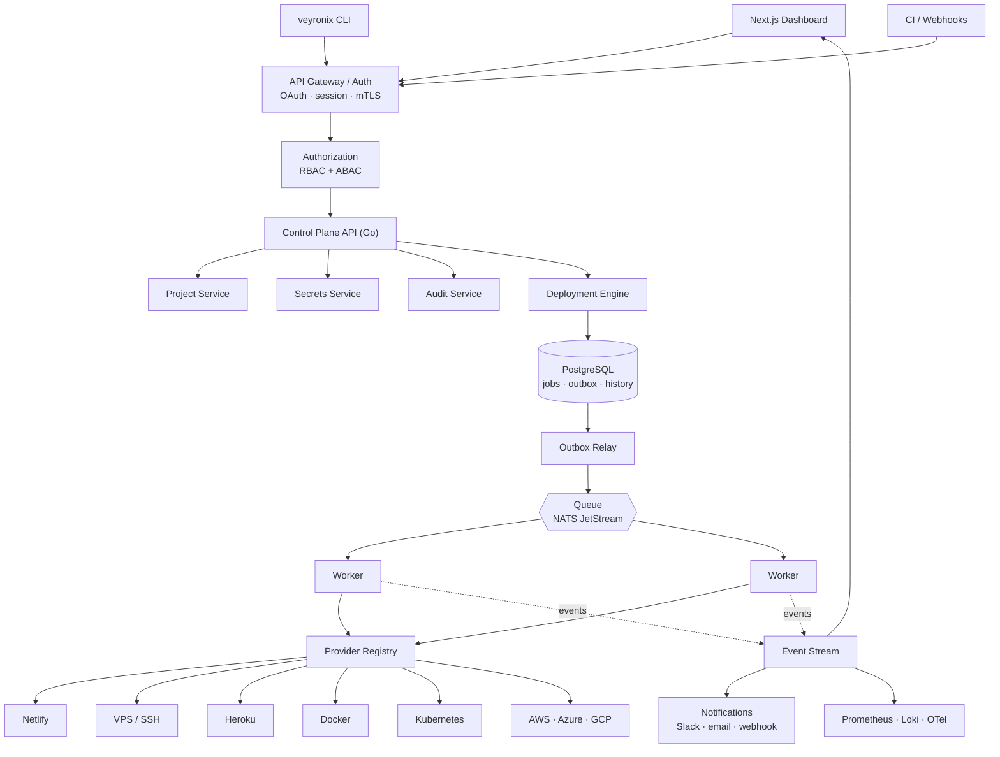
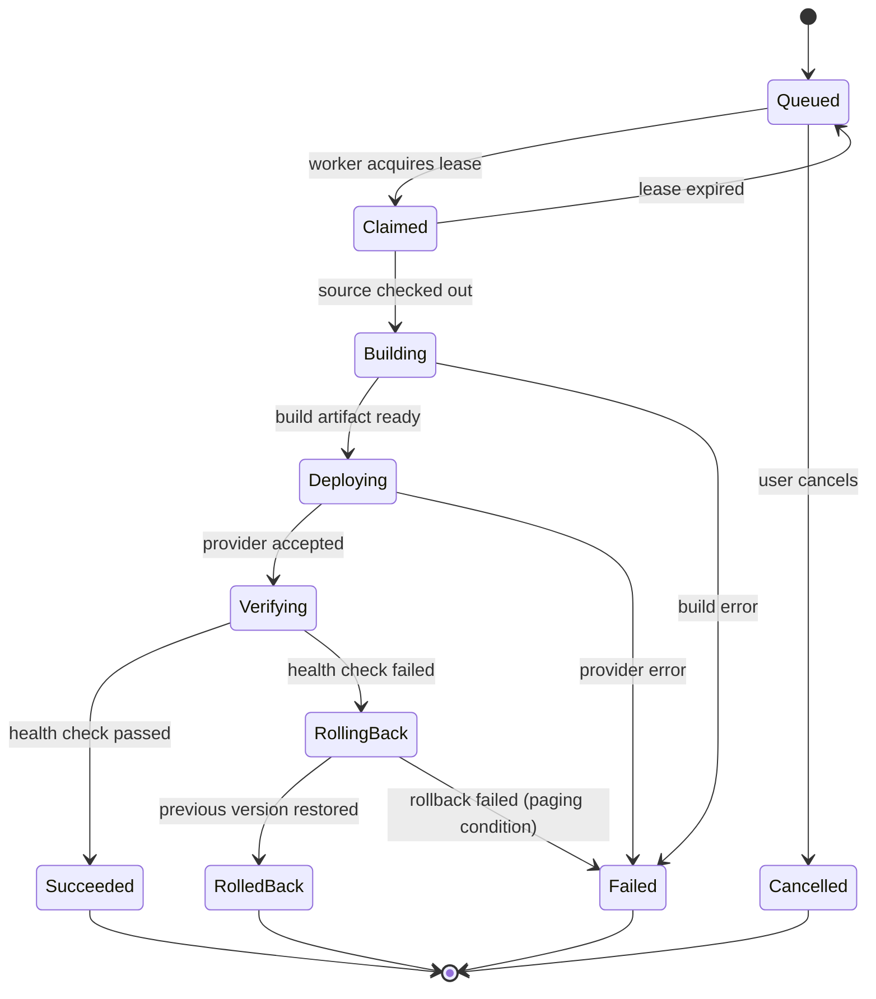

# Veyronix — Internal Developer Platform & Deployment Orchestrator

<div align="center">


[](https://github.com/nickemma/veyronix/actions)

**One deployment workflow for every infrastructure provider.**

_Provider-agnostic application delivery. Async, durable, resumable deployments. RBAC + ABAC on every action. SLO-driven from day one. Adding AWS is a plugin, not a rewrite._

[Architecture](#architecture) • [Design Doc](docs/DESIGN_DOC.md) • [ADRs](docs/adr/) • [SLOs](#service-level-objectives) • [Runbook](docs/RUNBOOK.md) • [Roadmap](#roadmap)

</div>

---

## Project Status

> **Veyronix is in active design and early implementation. It does not yet deploy anything end to end.**
> This README documents the system as designed, and marks precisely what exists today. Nothing below is claimed as shipped unless the status table says so. If you clone this repo expecting a working platform, you will be disappointed — for now.

| Component | State |
|---|---|
| Architecture, ADRs, threat model | Written |
| Protobuf service contracts | Drafted |
| Database schema + migrations | In progress |
| Control plane API (Go) | Skeleton |
| Deployment engine + job queue | Skeleton |
| Provider interface | Defined |
| Netlify / SSH / Heroku providers | Not started |
| Dashboard (Next.js) | Not started |
| Observability stack | Not started |

Follow along: the design is being written in public before the code, deliberately. Each ADR in `docs/adr/` is a decision made in the open, with the alternatives that lost and why.

---

## What is Veyronix?

Deployment knowledge does not scale. In most engineering organizations the frontend goes to Netlify, one backend lives on a VPS reached by SSH, an older service still runs on Heroku, and the newest thing landed on ECS because that is what the person who built it knew. Every one of those has a different workflow, a different credential path, a different failure mode, and a different person who understands it. The cost is not the deployment — it is that deployment becomes tribal knowledge, and tribal knowledge is an outage waiting for a vacation.

Veyronix collapses all of it behind one question: *which project, which environment, which version.* Everything after that is the platform's problem. The developer does not know or care whether the target is Netlify's API, an SSH session, a Kubernetes rollout, or an ECS task definition update. They see one button and one stream of logs.

The architectural bet that makes this possible is a single interface. The deployment engine never knows what a provider is. It knows only that something implements `Deploy`, `Rollback`, `Status`, `Logs`, and `HealthCheck`. Netlify is 200 lines behind that interface. So is SSH. So is ECS. Adding Google Cloud Run means writing a new provider and registering it — the engine is untouched, the dashboard is untouched, the permission model is untouched. Providers are plugins; the platform is not rewritten to accommodate them.

The second bet is that a deployment is not a function call. It is a durable, long-running, resumable job. A deploy that takes four minutes cannot live inside an HTTP request that a load balancer will kill at sixty seconds. It cannot vanish because a worker pod was rescheduled. It cannot silently double-execute because a user double-clicked. So a deploy request writes a job to Postgres, publishes an event, and returns immediately. A worker claims the job under a lease, executes it against the provider, and emits events the whole way. The UI subscribes to those events. If the worker dies, the lease expires and another worker resumes.

**The real question this system answers:** what is the state of a deployment when the machine running it disappears halfway through? Veyronix has a specific answer — the job is in Postgres, its lease has expired, its last emitted event is durable, and a new worker will pick it up idempotently. Most internal deploy scripts have no answer at all.

---

## What Each Layer Proves

| Layer | What It Demonstrates |
|---|---|
| Provider interface + registry | Abstraction design under real pressure — the contract survives seven wildly different targets |
| Durable job queue with leases | You know a deploy is a distributed job, not a request handler |
| Transactional outbox | Correctness at the DB/broker boundary — no lost or phantom deployments |
| Idempotency keys on deploy | Exactly-once semantics on an at-least-once substrate |
| Deployment state machine | Explicit lifecycle modelling instead of boolean soup |
| RBAC + ABAC hybrid | Authorization that survives contact with real org structure |
| Envelope-encrypted secrets | Credential handling that assumes the database will leak |
| Automatic rollback on health check failure | Reliability engineering, not just delivery |
| SLOs, SLIs, error budgets | You measure the platform the way you would measure production |
| Failure mode analysis + postmortem templates | SRE maturity — you designed for the bad day before it arrived |
| Provider SDK | Platform thinking — other people can extend it without your help |

---

## Architecture



> Replace with `docs/veyronix-architecture.png` once the diagram is rendered for the design doc.

---

## The Deployment Lifecycle

The naive model treats a deploy as a synchronous call:

```
User → Deploy → Provider → Done
```

That model breaks the first time a build takes longer than an HTTP timeout, the first time a worker restarts, and the first time someone double-clicks the button. Veyronix uses a durable pipeline instead:

```
Deploy Request
    ↓
API validates → authorizes → resolves provider
    ↓
Create Deployment Job          ─┐
    ↓                            │  single Postgres transaction
Persist Job + Outbox Event     ─┘
    ↓
Outbox Relay publishes to queue
    ↓
Worker claims job under lease
    ↓
Clone → Checkout → Build → Provider.Deploy()
    ↓
Publish progress events (streamed to UI)
    ↓
Provider.HealthCheck()
    ↓
   ┌──────────────┴──────────────┐
Healthy                      Unhealthy
   ↓                              ↓
Mark Succeeded            Provider.Rollback()
   ↓                              ↓
Notify · Audit            Mark Failed · Notify · Audit
```

Three properties fall out of this shape:

- **The job survives the worker.** Jobs live in Postgres, not in memory. A worker that dies mid-deploy loses its lease; another worker resumes from the last durable checkpoint.
- **The event and the job commit together.** The job row and the outbox row are written in one transaction. There is no window where a job exists but no worker will ever hear about it, and none where an event fires for a job that was rolled back.
- **The UI is a subscriber, not a poller.** Every state transition is an event. The dashboard, notifications, and metrics pipeline all consume the same stream.

### Deployment State Machine



`RollingBack → Failed` is the only transition that pages a human. Everything else is the system doing its job.

---

## The Four Pillars

### 1. Control Plane — `internal/api/`, `internal/identity/`

The front door. Authentication, authorization, project state, and the public contract.

- **OAuth via Google and GitHub** — no passwords stored, ever
- **Hybrid RBAC + ABAC** — roles (`admin`, `developer`, `viewer`) answer *what kind of action*; attributes answer *on which resource*. A developer on the Payments team can deploy the Payments API and cannot deploy the HR API, and that is one policy, not two role definitions
- **Project registry** — repositories, environments, deployment targets, members, environment variables, secret references, deployment history
- **Idempotency keys** — a deploy request carries a key derived from `(project, environment, commit_sha)`; a duplicate request returns the existing job rather than creating a second one
- **Connect-based API surface** — one `.proto` definition serves gRPC internally and HTTP/JSON to the browser (see [ADR-0004](docs/adr/0004-grpc-vs-rest.md))

Every mutating action produces an audit record before it produces an effect.

### 2. Deployment Engine — `internal/engine/`, `internal/worker/`

The heart of the system, and the part that has to be correct.

- **Durable job store** — deployments are rows in Postgres with an explicit state machine, not goroutines
- **Transactional outbox** — job and event commit atomically; a relay process tails the outbox and publishes to the broker. Chosen over dual-write because dual-write is silently wrong under partial failure ([ADR-0003](docs/adr/0003-transactional-outbox.md))
- **Lease-based work claiming** — a worker claims a job with a TTL lease and heartbeats while executing; expired leases are reclaimable, so worker death is a recoverable event rather than a stuck deployment
- **At-least-once delivery, exactly-once effect** — providers are called with an idempotency key so a redelivered job does not deploy twice
- **Concurrency control per environment** — one in-flight deployment per `(project, environment)`; further requests queue rather than race
- **Automatic rollback** — a failed health check triggers `Provider.Rollback()` to the last known-good release, if the environment has rollback enabled

### 3. Provider Layer — `internal/providers/`, `sdk/`

The abstraction the entire platform rests on.

```go
// Provider is the only thing the deployment engine knows about a target.
// Every deployment destination — a CDN, an SSH host, a Kubernetes cluster,
// an inference server — implements exactly this.
type Provider interface {
    // Name returns the registry identifier, e.g. "netlify", "k8s".
    Name() string

    // Validate checks target configuration and credentials before any
    // mutating call. Runs at project-save time, not at deploy time.
    Validate(ctx context.Context, target Target) error

    // Deploy performs the release. It must be idempotent with respect to
    // req.IdempotencyKey: a repeated call with the same key must not
    // produce a second release.
    Deploy(ctx context.Context, req DeployRequest) (Release, error)

    // Rollback restores a previously successful release.
    Rollback(ctx context.Context, to Release) error

    // Status reports the live state of a release at the target.
    Status(ctx context.Context, rel Release) (ReleaseStatus, error)

    // Logs streams provider-side logs until ctx is cancelled.
    Logs(ctx context.Context, rel Release, opts LogOptions) (<-chan LogLine, error)

    // HealthCheck verifies the release is serving. Returning an error
    // triggers rollback if the environment has it enabled.
    HealthCheck(ctx context.Context, rel Release) error

    // Capabilities declares what this provider supports so the engine and
    // UI can degrade gracefully — not every target can roll back or stream.
    Capabilities() Capabilities
}
```

`Capabilities()` exists because honesty beats a leaky abstraction. Netlify cannot do a canary. A bare VPS cannot do blue/green without help. Rather than pretending every provider is equivalent, providers declare what they support and the platform hides the controls that would not work.

The `sdk/` package exposes this interface plus test harnesses and a conformance suite, so a third party can write a provider and prove it correct without reading the engine.

### 4. Reliability & Observability — `internal/telemetry/`, `docs/sre/`

A platform every team depends on has to be measured like production, because it is production.

- **Prometheus metrics** on every stage of the pipeline (see [Metrics](#metrics))
- **OpenTelemetry traces** spanning request → job → worker → provider call, so a slow deploy can be attributed to build, queue, or provider latency rather than guessed at
- **Loki-aggregated logs** correlated by deployment ID
- **Grafana dashboards** for deployment throughput, queue depth, provider error rates, and error budget burn
- **SLOs with error budgets** — defined below, tracked continuously, and used to gate feature work
- **Failure mode analysis** — documented, with detection signal and mitigation for each
- **Postmortem template** in `docs/sre/postmortem-template.md`, blameless, with a required action-item owner

---

## Service Level Objectives

The platform is measured the way a real production dependency should be.

| SLI | Definition | SLO | Error Budget |
|---|---|---|---|
| **API availability** | Non-5xx control plane responses ÷ total | 99.9% / 30d | ~43m downtime |
| **Deployment success rate** | Succeeded ÷ (Succeeded + platform-caused Failed). User build errors excluded | 99.0% / 30d | 1 in 100 deploys |
| **Queue time** | Job persisted → worker claim, p95 | < 10s | 5% may exceed |
| **Mean time to deploy** | Deploy accepted → health check passed, p95 | < 5m | 5% may exceed |
| **Rollback success rate** | Successful rollbacks ÷ attempted | 99.5% / 30d | 1 in 200 |
| **Mean time to recovery** | Failed deploy → previous version healthy, p95 | < 3m | 5% may exceed |
| **Event delivery lag** | Provider event emitted → visible in UI, p99 | < 2s | 1% may exceed |

**Error budget policy:** when a 30-day budget is more than 50% consumed, new provider work stops and reliability work takes priority until the budget recovers. When it is fully consumed, deployments to the platform itself require review. The budget is the forcing function — it is what makes reliability a constraint rather than an aspiration.

Capacity planning notes, load test results, and headroom analysis live in `docs/sre/capacity.md`.

---

## Metrics

Every metric below is a deliberate answer to a question someone will ask during an incident.

| Metric | Type | Labels | Question it answers |
|---|---|---|---|
| `veyronix_deployment_duration_seconds` | histogram | provider, project, env, outcome | Which provider is slow? |
| `veyronix_deployment_total` | counter | provider, env, outcome | What is our success rate? |
| `veyronix_rollback_total` | counter | provider, env, trigger | Are we shipping broken releases? |
| `veyronix_deployment_queue_wait_seconds` | histogram | env, priority | Are we worker-starved? |
| `veyronix_deployment_queue_depth` | gauge | env | Is backlog growing? |
| `veyronix_build_duration_seconds` | histogram | project, language | Where is deploy time actually going? |
| `veyronix_healthcheck_duration_seconds` | histogram | provider, env | Are health checks the bottleneck? |
| `veyronix_time_to_recovery_seconds` | histogram | provider, env | How fast do we recover? |
| `veyronix_provider_api_errors_total` | counter | provider, error_class | Is a provider degraded right now? |
| `veyronix_worker_active_jobs` | gauge | worker_id | Are workers balanced? |
| `veyronix_job_lease_expirations_total` | counter | reason | Are workers dying? |
| `veyronix_authz_denials_total` | counter | policy, subject_role | Is the permission model wrong or is someone probing? |

Deployment duration is split into queue / build / deploy / verify phases rather than reported as a single number, because "deploys are slow" is not actionable and "the build phase p95 doubled after the base image change" is.

---

## Failure Mode Analysis

| Failure | Blast Radius | Detection | Mitigation |
|---|---|---|---|
| Worker dies mid-deploy | One deployment | Lease heartbeat stops | Lease expires, job reclaimed, idempotency key prevents duplicate release |
| Provider API down or rate-limited | All deploys to that provider | `provider_api_errors_total` spike | Circuit breaker opens, jobs requeue with exponential backoff, other providers unaffected |
| Message broker unavailable | New deploys queue | Outbox relay lag alert | Jobs persist in Postgres; relay drains backlog on recovery — no deployments lost |
| Postgres unavailable | Full control plane | Health endpoint fails | API returns 503 for mutations; in-flight worker jobs complete and buffer results |
| Health check fails after deploy | One environment | Verify stage fails | Automatic rollback to last-known-good, incident event emitted |
| Secret decryption fails | One deployment | Pre-flight error | Deploy aborted before any provider call — no partial state at the target |
| Duplicate deploy request | None | Idempotency key collision | Existing job returned; no second release |
| Two workers claim one job | One deployment | Optimistic lock conflict | Row-level lease with version check; loser drops the job |
| Rollback itself fails | One environment | `RollingBack → Failed` | Page on-call, freeze environment, runbook `docs/RUNBOOK.md#rollback-failure` |

---

## Tech Stack

| Layer | Technology | Why |
|---|---|---|
| **Control plane API** | Go + Connect | One `.proto` serves gRPC internally and JSON to the browser |
| **Deployment engine** | Go | Long-lived workers, native concurrency, single static binary per worker |
| **Job store + outbox** | PostgreSQL | Transactional job state and event publication in one commit |
| **Message broker** | NATS JetStream | Durable streams, at-least-once delivery, far less operational weight than Kafka at this scale |
| **Dashboard** | Next.js + TypeScript | Server components for project state, streaming for live deploy logs |
| **UI layer** | Tailwind · shadcn/ui · TanStack Query · Zustand · Zod | Typed end to end; Zod schemas generated from the same protos |
| **Secrets** | AES-256-GCM envelope encryption | Assumes the database leaks; only decrypted in worker memory at deploy time |
| **Build isolation** | Docker | Untrusted user code never runs on the worker host |
| **Observability** | Prometheus · Grafana · Loki · OpenTelemetry | Metrics, dashboards, logs, and traces correlated by deployment ID |
| **CI/CD** | GitHub Actions | The platform deploys itself through itself, once V1 lands |

---

## Security as First Principles

- **No standing credentials in the database** — provider credentials are envelope-encrypted; the data encryption key is wrapped by a KEK held outside Postgres
- **Secrets decrypted only in worker memory** — never written to disk, never in build logs, never in the event stream; log lines are scrubbed against known secret values before emission
- **Deny by default** — a subject with no matching policy can deploy nothing; access is explicit grant only
- **Every action authenticated and audited** — the audit record is written before the effect, with subject, resource, decision, and request ID
- **Build isolation** — user repositories are cloned and built inside a container with no network egress by default and no access to the worker's credentials
- **Least-privilege provider credentials** — documented minimum IAM policy per provider in `docs/providers/`, because "give it admin" is how platforms become breaches
- **mTLS between internal services** once the control plane and workers split into separate deployments
- **Threat model** in `docs/THREAT_MODEL.md` covering credential theft, privilege escalation via project membership, malicious build scripts, and provider token exfiltration

---

## Quick Start

> Applies to the local skeleton. It will start the control plane and a worker; provider implementations are not yet functional.

### Prerequisites

- Go 1.25
- Node 22 + pnpm
- Docker + docker-compose
- `buf` for protobuf generation

```bash
# Clone
git clone https://github.com/nickemma/veyronix.git
cd veyronix

# Bring up Postgres, NATS, Prometheus, Grafana
make infra-up

# Generate protobuf + typed clients
make proto

# Run migrations
make migrate-up

# Start control plane, worker, and dashboard
make dev

# Dashboard: http://localhost:3000
# API:       http://localhost:8080
# Grafana:   http://localhost:3001
```

### CLI

```bash
# Register a project
veyronix project create \
  --name ecommerce-api \
  --repo github.com/acme/ecommerce-api \
  --provider netlify

# Deploy
veyronix deploy \
  --project ecommerce-api \
  --env production \
  --version latest

# Stream live logs for a running deployment
veyronix logs --deployment dpl_01HQ8 --follow

# Deployment history
veyronix history --project ecommerce-api --env production --last 20

# Roll back to the previous successful release
veyronix rollback --project ecommerce-api --env production

# Inspect what a subject is allowed to do
veyronix authz explain \
  --subject alice@acme.io \
  --action deploy \
  --resource project/ecommerce-api/production
```

### Service Contract

```protobuf
service DeploymentService {
  rpc CreateDeployment(CreateDeploymentRequest) returns (Deployment);
  rpc GetDeployment(GetDeploymentRequest)       returns (Deployment);
  rpc ListDeployments(ListDeploymentsRequest)   returns (ListDeploymentsResponse);
  rpc CancelDeployment(CancelDeploymentRequest) returns (Deployment);
  rpc Rollback(RollbackRequest)                 returns (Deployment);

  // Server-streaming: the reason internal transport is gRPC and not REST.
  rpc StreamEvents(StreamEventsRequest) returns (stream DeploymentEvent);
  rpc StreamLogs(StreamLogsRequest)     returns (stream LogLine);
}

message CreateDeploymentRequest {
  string project_id      = 1;
  string environment     = 2;
  string version         = 3;  // commit SHA, tag, or "latest"
  string provider        = 4;  // empty = auto-detect from project config
  string idempotency_key = 5;  // required; derived from project+env+version
  bool   auto_rollback   = 6;
}

message Deployment {
  string           id            = 1;
  DeploymentState  state         = 2;
  string           provider      = 3;
  string           release_id    = 4;
  string           triggered_by  = 5;
  PhaseTimings     timings       = 6;  // queue, build, deploy, verify
  string           previous_id   = 7;  // rollback target
}
```

### Environment Variables

```bash
VEYRONIX_API_PORT=8080
VEYRONIX_DATABASE_URL=postgres://veyronix@localhost:5432/veyronix
VEYRONIX_NATS_URL=nats://localhost:4222

VEYRONIX_KEK=<32-byte-key>                   # wraps per-project data keys
VEYRONIX_OAUTH_GITHUB_CLIENT_ID=
VEYRONIX_OAUTH_GOOGLE_CLIENT_ID=

VEYRONIX_WORKER_CONCURRENCY=4                # jobs per worker
VEYRONIX_JOB_LEASE_TTL=60s                   # reclaim window after worker death
VEYRONIX_JOB_HEARTBEAT_INTERVAL=15s
VEYRONIX_DEPLOY_TIMEOUT=30m
VEYRONIX_BUILD_TIMEOUT=20m
VEYRONIX_HEALTHCHECK_TIMEOUT=2m
VEYRONIX_HEALTHCHECK_RETRIES=5
VEYRONIX_AUTO_ROLLBACK=true

VEYRONIX_OUTBOX_POLL_INTERVAL=1s
VEYRONIX_PROVIDER_CIRCUIT_THRESHOLD=5        # consecutive failures before open
VEYRONIX_OTEL_ENDPOINT=http://localhost:4317
```

---

## Roadmap

**V1 — Replace manual deployment**
Login · projects · deploy · deployment history · logs · SSH/VPS provider · Netlify provider · Heroku provider

**V2 — Developer experience**
Rollback · environment variables · secrets management · GitHub integration · deployment queue · health checks · notifications

**V3 — Platform maturity**
Docker · Docker Compose · Kubernetes · Helm · blue/green · canary · approval workflows · scheduled deployments

**V4 — Enterprise**
AWS · Azure · GCP · full RBAC/ABAC · audit export · multiple organizations · SSO · multi-region · cost reporting · rate limiting · API keys · public API · CLI · SDK

**V5 — Model serving as a deployment target**
The provider abstraction does not care what is being deployed. A model is a release with a different runtime. Candidate providers under evaluation — a subset will be chosen, not all of them: Kubernetes · Nomad · Ollama · vLLM · NVIDIA Triton · KServe. Supporting storage and infrastructure providers under the same evaluation: MinIO · S3 · Kafka · NATS · Vault.

**Long-term** — the platform becomes the engineering portal: provision databases and caches, create namespaces, request production access, rotate secrets, manage DNS and certificates, run migrations, manage feature flags and cron jobs. Everything self-service.

---

## Non-Goals

Stating these keeps the abstraction from dissolving:

- **Not a CI system.** Veyronix deploys artifacts and can invoke a build, but it does not replace GitHub Actions.
- **Not an infrastructure provisioner.** Terraform creates the cluster; Veyronix deploys onto it. (V5 revisits this deliberately, not accidentally.)
- **Not a monitoring platform.** It emits telemetry to your stack; it does not become your stack.
- **Not a lowest-common-denominator abstraction.** Providers declare capabilities honestly rather than pretending every target supports canary deployments.

---

## Engineering Deep Dive

Key system design areas implemented in Veyronix:

- Provider abstraction under adversarial variety — one interface across CDN, SSH, PaaS, container orchestrator, and cloud-native targets, with explicit capability negotiation instead of a leaky common denominator
- Durable job orchestration — Postgres-backed state machine, lease-based claiming, heartbeat liveness, crash recovery, per-environment concurrency control
- Transactional outbox — atomic job and event commit, relay-based publication, at-least-once delivery with exactly-once effects via provider idempotency keys
- Hybrid authorization — RBAC for action classes, ABAC for resource scoping, deny-by-default, explainable decisions via `authz explain`
- Secrets lifecycle — envelope encryption, KEK/DEK separation, memory-only decryption, log scrubbing, least-privilege provider credentials
- Build isolation — containerized builds, no network egress by default, no worker credential access from user code
- Reliability engineering — SLO definition, error budget policy as a work-gating mechanism, failure mode analysis, blameless postmortem process
- Observability — phase-decomposed deployment latency, trace propagation across the async boundary, correlation by deployment ID
- Transport design — Connect-based single schema serving gRPC internally and HTTP/JSON at the edge, with server-streaming for logs and deadline propagation for cancellation

**Blog (coming soon):** _"Veyronix: Building an Internal Platform From First Principles."_

---

## Documentation

| Document | Contents |
|---|---|
| [`docs/DESIGN_DOC.md`](docs/DESIGN_DOC.md) | Full system design |
| [`docs/adr/`](docs/adr/) | Architecture Decision Records — every major choice and the alternatives that lost |
| [`docs/THREAT_MODEL.md`](docs/THREAT_MODEL.md) | Attack surface, trust boundaries, mitigations |
| [`docs/sre/slo.md`](docs/sre/slo.md) | SLO definitions and error budget policy |
| [`docs/sre/capacity.md`](docs/sre/capacity.md) | Capacity planning and load test results |
| [`docs/sre/postmortem-template.md`](docs/sre/postmortem-template.md) | Blameless postmortem template |
| [`docs/RUNBOOK.md`](docs/RUNBOOK.md) | Operational procedures and incident response |
| [`docs/providers/`](docs/providers/) | Per-provider setup and minimum IAM policies |
| [`api/openapi.yaml`](api/openapi.yaml) | Generated OpenAPI specification |
| [`sdk/README.md`](sdk/README.md) | Provider SDK — write your own deployment target |

---

## Contributing

Veyronix is being built in public. The most useful contribution right now is a critique of a design decision in `docs/adr/` — open an issue naming the ADR and the failure case you think it misses.

Provider implementations are the second most useful. `sdk/` includes a conformance suite; a provider that passes it will integrate without engine changes.

---

## One Platform, Six Repositories

These are not six projects. **EMBER** fronts everything · **LATTICE** proves the distributed
core · **MERIDIAN** provides secrets, policy, lease and audit · **VEYRONIX** consumes MERIDIAN
and operates services · **TESSERA** is served behind EMBER and operated like VEYRONIX ·
**SYNAPSE-AI** governs TESSERA's agents using MERIDIAN's lineage and EMBER's data plane.

Veyronix is where the platform patterns are set: the provider abstraction, the durable job
model, and the SLO discipline that TESSERA reuses when it operates GPU nodes.

[EMBER](https://github.com/nickemma/ember) · [LATTICE](https://github.com/nickemma/lattice) ·
[MERIDIAN](https://github.com/nickemma/meridian) · [VEYRONIX](https://github.com/nickemma/veyronix) ·
[TESSERA](https://github.com/nickemma/tessera) · [SYNAPSE-AI](https://github.com/nickemma/synapse-ai)


## Author

**[@nickemma](https://github.com/nickemma)** — Building production-grade distributed systems, infrastructure, and platform engineering from first principles.

💼 Open to distributed systems, infrastructure, platform, and backend engineering roles at companies building serious systems.

<div align="center">
<a href="https://www.linkedin.com/in/techieemma/"></a>
<a href="https://twitter.com/techieemma"></a>
<a href="https://github.com/nickemma/"></a>
<a href="https://techieemma.medium.com/"></a>
<a href="mailto:nicholasemmanuel321@gmail.com"></a>
</div>

---

<div align="center">

**Building Systems, Building Faith — One Commit at a Time**

[⬆ Back to Top](#veyronix--internal-developer-platform--deployment-orchestrator)

</div>
