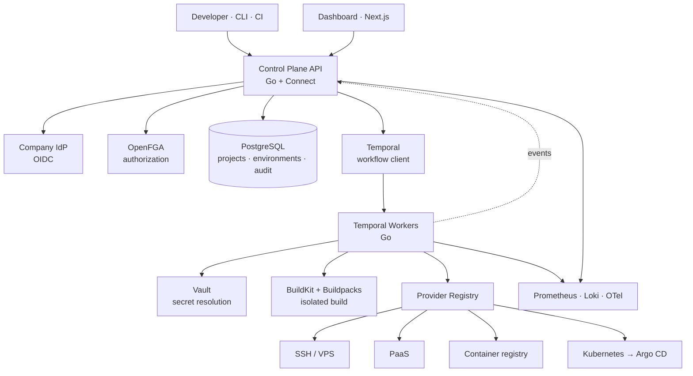

# Veyronix — Engineering Design

**Companion to:** `RPD.md` (what and why) — this document is *how*.
**Status:** Design. Implementation follows the build order in the RPD.

---

## 1. The one thing we build

Veyronix builds a **provider abstraction over heterogeneous deployment targets**. That is the entire original contribution. Every other concern in this system — durable execution, authorization, secrets, identity, builds, observability — is delegated to a tool that already solves it better than we would.

This is a deliberate reversal of the earlier design, which hand-built a job queue, an authorization engine, an envelope-encryption scheme, and an OAuth session layer. Each of those is a correct thing to write once in your life to understand it. None of them is a correct thing to run in production at a payments company with a bus factor of one.

The test applied to every component below: **if this breaks at 2am and I am unavailable, can someone else fix it?** A hand-rolled lease-based job queue fails that test. Temporal passes it, because its failure modes are documented, searchable, and shared by thousands of other users.

---

## 2. Build vs. buy — the decisions

| Concern | Earlier design | Now | Reasoning |
|---|---|---|---|
| **Durable execution** | Postgres job table + lease claiming + heartbeats + transactional outbox + NATS relay | **Temporal** | The README's own framing was "what is the state of a deployment when the machine running it disappears halfway through." That sentence is Temporal's product description. It provides durable workflow state, automatic retries with backoff, heartbeating activities, timeouts, workflow versioning, and a visibility UI. Hand-rolling it means owning the hardest correctness code in the system — the part where bugs are silent and only appear under partial failure. |
| **Authorization** | Hand-rolled hybrid RBAC + ABAC | **OpenFGA** | Google Zanzibar model. `Check` answers "may this subject do this?"; `Expand` and `ListObjects` give the `authz explain` capability for free. Relationship tuples model "developer on team Payments" natively, which is exactly the shape the requirement takes. |
| **Secrets** | AES-256-GCM envelope encryption in Postgres, KEK held outside | **HashiCorp Vault** (or cloud KMS + Secrets Manager) | Rotation, leases, dynamic credentials, and an independent audit log. For a payments company this is also what an auditor expects to see; a bespoke encryption scheme invites a question you do not want to spend the meeting answering. |
| **Identity** | Custom OAuth via Google/GitHub, own sessions | **OIDC against the company IdP** (Dex if a broker is needed) | An internal tool must use corporate identity — offboarding has to revoke access automatically. Group claims from the IdP feed OpenFGA tuples. |
| **Builds** | Bespoke Docker build per project | **Cloud Native Buildpacks** (`pack`) + **BuildKit** rootless | Buildpacks remove the need for a Dockerfile per repository and handle language detection, dependency caching, and base-image patching. Rootless BuildKit gives isolation without granting the Docker socket. |
| **Kubernetes target** | Direct client-go calls from a worker | **Argo CD behind the provider** | Veyronix's K8s provider writes manifests to a git repository; Argo reconciles and reports health. Veyronix reads that status. Push-based deploys into a cluster from an external system is the pattern GitOps exists to replace. |
| **Observability** | Prometheus · Grafana · Loki · OpenTelemetry | **Unchanged** | Already the real tools. |
| **API transport** | Go + Connect, one proto | **Unchanged** | Correct choice. Server-streaming for logs is the right reason to pick it. |
| **Provider interface** | Custom | **Unchanged — this is the product** | Nothing off-the-shelf spans CDN, SSH, PaaS, and Kubernetes behind one contract. |

### What this removes

Roughly the following disappear from the codebase, and with them their failure modes:

- Lease acquisition and renewal, and the race between reclaim and completion
- Outbox relay, its poll loop, and its lag monitoring
- Dual-write reasoning at the database/broker boundary
- NATS JetStream as an operational dependency
- Worker crash-recovery logic and its test matrix
- A policy evaluation engine and its correctness tests
- Envelope encryption, key wrapping, and key rotation procedure
- Session storage, refresh handling, and CSRF surface

That is not a small refactor. It is most of the hard code in the system, replaced by configuration and two well-documented dependencies.

---

## 3. Architecture



**Three processes:** the control plane API, Temporal workers, and the dashboard. Temporal, Postgres, Vault, and OpenFGA are dependencies, not components we operate the internals of.

---

## 4. The deployment workflow

A deployment is a Temporal workflow. Each step below is a Temporal *activity* — independently retried, independently timed out, and durably recorded.

```
DeploymentWorkflow(project, env, version, idempotencyKey)
  │
  ├─ ResolveTarget          provider + config for this environment
  ├─ AwaitApproval          [production only] signal-based, with timeout
  ├─ ResolveSecrets         Vault; returned into activity memory only
  ├─ Checkout               clone at commit into isolated workspace
  ├─ Build                  Buildpacks in rootless BuildKit → artifact
  ├─ Deploy                 provider.Deploy(ctx, req) — idempotency key propagated
  ├─ HealthCheck            provider.HealthCheck, retried with backoff
  │
  ├─ if healthy   → RecordSuccess, Notify
  └─ if unhealthy → Rollback → RecordRollback, Notify
                    └─ if rollback fails → FreezeEnvironment, PageOnCall
```

**Why each property now comes for free:**

| Property | Mechanism |
|---|---|
| Survives worker death | Temporal replays workflow history onto a new worker; completed activities are not re-executed |
| Exactly-once effect | Workflow ID = `{project}-{env}-{commit}`; Temporal rejects a duplicate start. The idempotency key is additionally passed to the provider as defence in depth |
| Per-environment concurrency of one | A long-running `EnvironmentWorkflow` per (project, environment) serialises child deployments — no distributed lock needed |
| Approval gate | `workflow.GetSignalChannel` with a timeout; the workflow simply waits, durably, for days if necessary |
| Cancellation | Temporal cancellation propagates to activity contexts |
| Progress events | Activities emit to the event stream; workflow history is itself the durable record |

The `EnvironmentWorkflow` pattern deserves a note: rather than a queue with locks, each (project, environment) has one long-lived workflow that receives deploy requests as signals and runs them as child workflows one at a time. Concurrency control becomes a consequence of the execution model rather than a thing to get right.

---

## 5. The provider contract

Unchanged from the original design, and correct as written.

```go
type Provider interface {
    Name() string
    Validate(ctx context.Context, target Target) error
    Deploy(ctx context.Context, req DeployRequest) (Release, error)
    Rollback(ctx context.Context, to Release) error
    Status(ctx context.Context, rel Release) (ReleaseStatus, error)
    Logs(ctx context.Context, rel Release, opts LogOptions) (<-chan LogLine, error)
    HealthCheck(ctx context.Context, rel Release) error
    Capabilities() Capabilities
}
```

Two constraints implementers must honour:

**Idempotency.** `Deploy` may be called more than once with the same `req.IdempotencyKey` — an activity retry, a worker replacement, a network timeout where the call actually succeeded. A repeated call with the same key must not produce a second release. Where the target has no native idempotency, the provider tags releases with the key and checks before acting.

**Capability honesty.** `Capabilities()` exists because a leaky abstraction is worse than an incomplete one. A CDN target cannot do canary. A bare VPS cannot do blue/green unaided. Providers declare what they support; the engine and UI degrade visibly rather than failing at runtime.

The `sdk/` package ships this interface plus a conformance suite. A provider that passes the suite integrates without engine changes — that is the assertion the whole architecture rests on, so it is tested rather than assumed.

---

## 6. Authorization model

OpenFGA store definition, in outline:

```
type user
type team
  relations
    define member: [user]
type project
  relations
    define owner: [team]
    define deployer: member from owner
    define viewer:  member from owner
type environment
  relations
    define project: [project]
    define deployer: deployer from project
    define approver: [user, team#member]
```

The check performed on a deploy request is `Check(user, "deployer", environment:payments-api/production)`. Production environments additionally require a distinct `approver` who is not the requesting subject — that second condition is application logic, not a tuple, because "not the same person" is not expressible relationally.

Group membership is synced from IdP claims on login, so offboarding at the IdP revokes platform access without a separate step.

**Deny by default.** No tuple, no access. There is no implicit grant anywhere in the model.

---

## 7. Secrets handling

1. Projects store secret *references* (`vault://kv/payments-api/production#DATABASE_URL`), never values.
2. The `ResolveSecrets` activity authenticates to Vault using the worker's own identity and fetches values into memory.
3. Values are passed to the build and deploy activities in memory only — never written to disk, never into the workflow history (Temporal payloads for this activity are marked non-persisted or encrypted with a data converter).
4. Every emitted log line is scrubbed against the resolved values before it reaches the event stream, Loki, or the UI.
5. Provider credentials are Vault dynamic secrets where the target supports it, static with documented least-privilege scope where it does not.

Point 3 is the one most easily got wrong: Temporal persists activity inputs and outputs by default. Secrets must go through a custom `DataConverter` that encrypts payloads, or be resolved inside the activity that uses them rather than passed between activities. **We do the latter** — `ResolveSecrets` is fused into `Build` and `Deploy` rather than being a separate step whose output crosses the history boundary. The workflow diagram above shows it separately for clarity; the implementation does not.

---

## 8. Build isolation

User repository code is untrusted. It runs:

- In a container, via rootless BuildKit — no Docker socket is mounted anywhere
- With no network egress by default; a project may declare required egress hosts, which are allowlisted
- With no access to the worker's Vault token, cloud credentials, or Temporal client
- Under a wall-clock timeout and memory limit

Cloud Native Buildpacks handle language detection and dependency installation, which removes the most common reason teams ask for arbitrary build scripts.

---

## 9. Data model

Postgres holds what is not workflow state:

| Table | Contents |
|---|---|
| `projects` | name, repository, owning team |
| `environments` | project, name, provider, target config, auto-rollback flag, approval required |
| `secret_refs` | environment, key, vault path — never values |
| `deployments` | id, workflow id, project, environment, version, state, actor, timings, release id |
| `releases` | provider release identifier, artifact digest, previous release |
| `audit_log` | append-only: actor, action, resource, decision, approval ref, request id, timestamp |

`audit_log` is append-only at the database level (no `UPDATE` or `DELETE` grant for the application role) and retained independently of `deployments`, which may be pruned.

Deployment execution state is **not** duplicated here — Temporal owns it. The `deployments` row is a projection updated by the workflow for querying and joining, not a second source of truth. Where the two disagree, Temporal wins, and reconciliation is a documented runbook procedure.

---

## 10. Failure modes

| Failure | Blast radius | Detection | Mitigation |
|---|---|---|---|
| Temporal worker dies mid-deploy | One deployment | Activity heartbeat timeout | Workflow resumes on another worker from last completed activity |
| Temporal service unavailable | New deploys cannot start | Client health check | API returns 503 for deploy; in-flight workflows resume on recovery; no state lost |
| Provider API down or rate-limited | Deploys to that provider | Provider error rate metric | Activity retry policy with exponential backoff; circuit breaker per provider; other providers unaffected |
| Postgres unavailable | Control plane reads/writes | Health endpoint | API 503 for mutations; running workflows continue and reconcile the projection on recovery |
| Vault unavailable | Deploys requiring secrets | Resolve activity failure | Deploy fails before any provider call — no partial state at the target |
| OpenFGA unavailable | All authorized actions | Check timeout | **Fail closed.** Denial is the safe answer; documented and alerted |
| Health check fails after deploy | One environment | Verify activity | Automatic rollback to last known-good |
| Rollback itself fails | One environment | Rollback activity exhausts retries | Freeze environment, page on-call, runbook procedure |
| Duplicate deploy request | None | Workflow ID collision | Temporal rejects the duplicate start; existing deployment returned |
| Secret leaked into a log line | Potentially severe | Scrubber unit tests + post-hoc scan | Scrub before emission; rotate on any confirmed leak; incident procedure in runbook |

The OpenFGA row is worth stating explicitly because fail-open is a tempting default when an authorization dependency is down and deploys are blocked. It is the wrong default here.

---

## 11. Operational ownership

An internal platform with one maintainer is a liability regardless of its code quality. Requirements:

- Every procedure in `docs/RUNBOOK.md` is executable by an engineer who did not build the system.
- The runbook is rehearsed: a second engineer performs a production rollback unaided before v1 is declared done.
- Dependencies (Temporal, Vault, OpenFGA, Postgres) are either managed services or have documented backup and restore procedures that have been tested by restoring.
- No component's operation depends on knowledge that exists only in the author's head. Where it currently does, that is tracked as a defect.

---

## 12. What is deliberately deferred

| Deferred | Why | Revisit when |
|---|---|---|
| Canary and blue/green | Requires provider-side traffic splitting; only some targets support it | Two providers support it and a team asks |
| Multi-region control plane | Single-region availability has not yet been the limiting factor | An SLO breach traces to region failure |
| Cost reporting | Needs provider billing APIs; adjacent to the core problem | Adoption is broad enough that spend attribution matters |
| Self-service provisioning | Different problem — that is Terraform's job with an approval workflow on top | The deployment problem is solved and in steady state |
| Model-serving targets | The provider abstraction supports it in principle; nothing at the company needs it yet | A model needs deploying |

---

## 13. Open questions

1. **Temporal self-hosted or Cloud?** Self-hosting adds a Cassandra/Postgres cluster to operate — which contradicts the bus-factor principle above. Temporal Cloud costs money and may need procurement approval. This should be resolved before build order row 3, not during it.
2. **Does the company already have Vault, or is this its introduction?** If introducing it, the effort belongs on the roadmap explicitly rather than hidden inside a Veyronix row.
3. **Which environment is the pilot?** A non-production service owned by a team willing to give feedback. Naming it early prevents the platform from being designed for a hypothetical user.
4. **Who is the second operator?** Answer this at row 1, not row 12.
